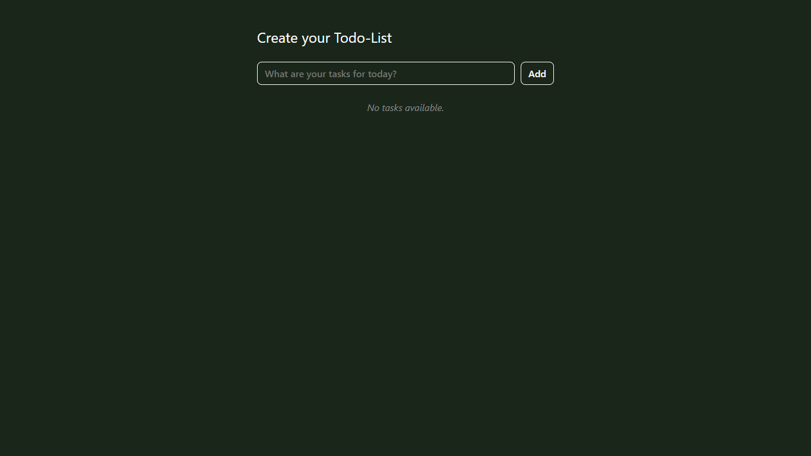
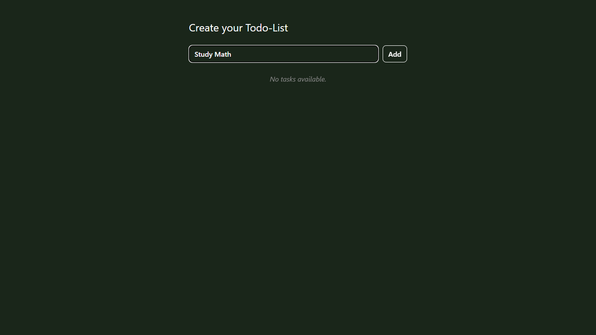
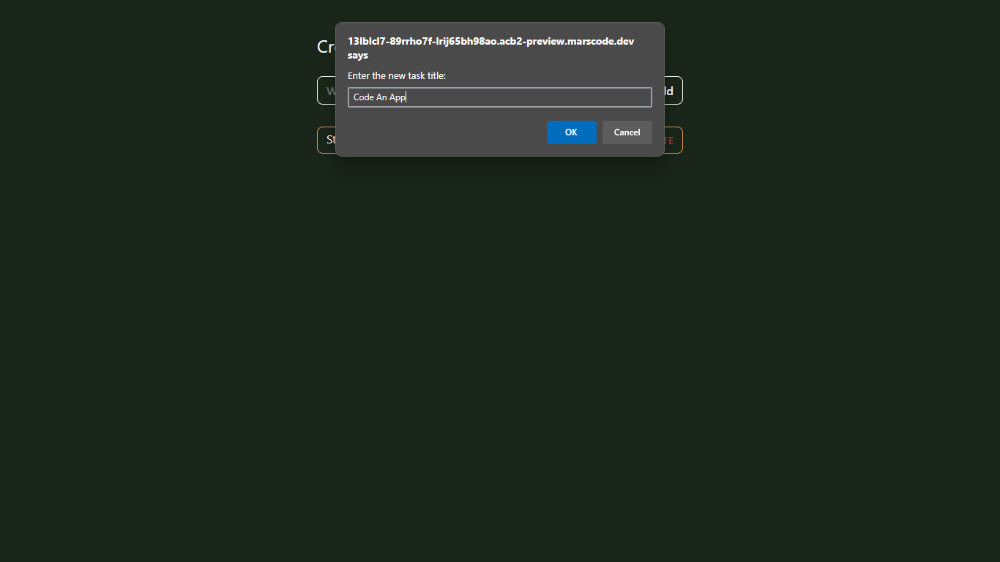
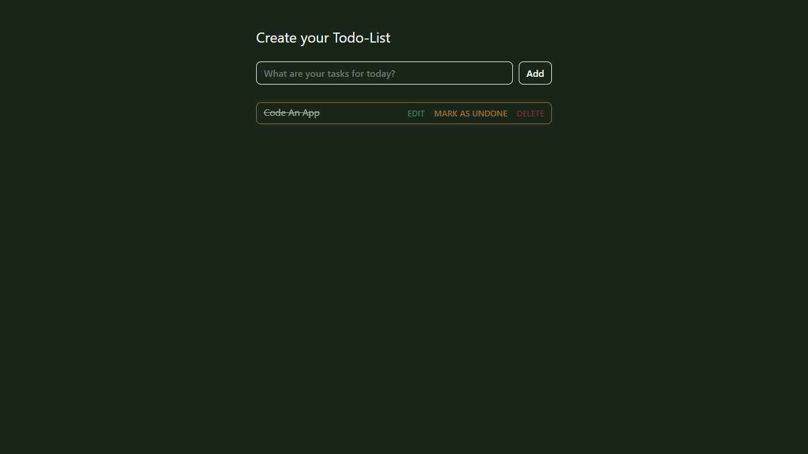
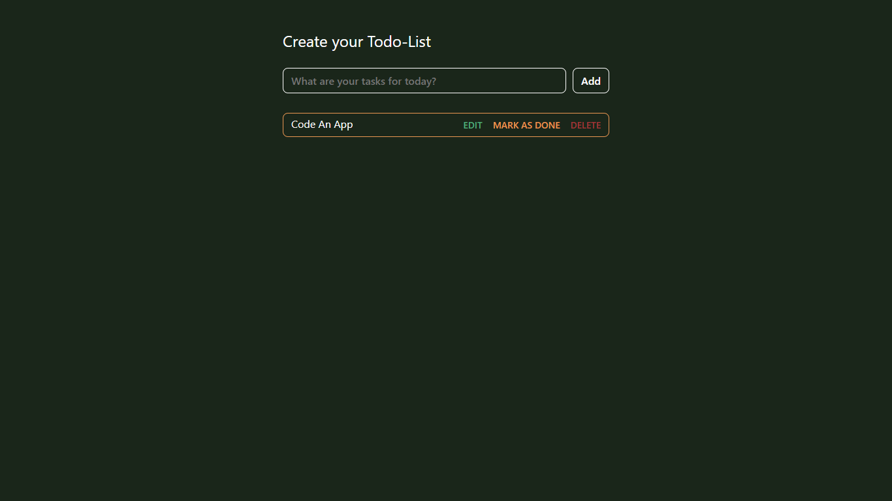
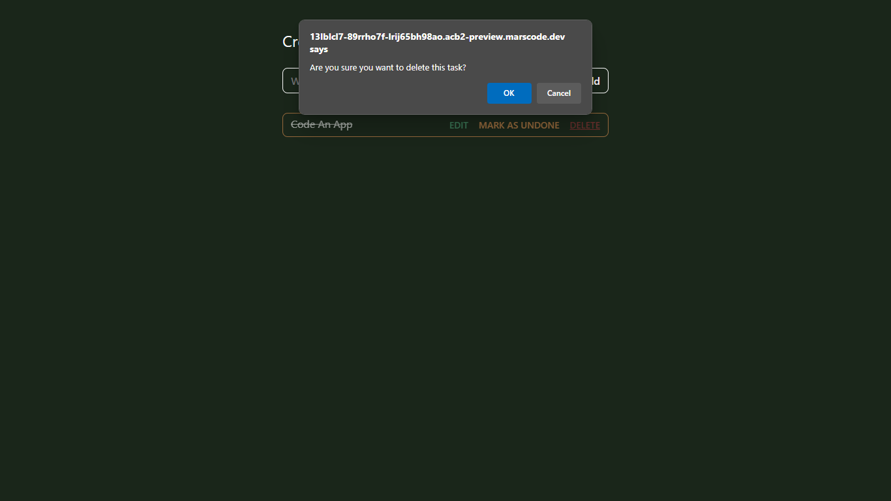

# Introduction
The Todo-App was made by Lechcher

# Get started
### Create a task
- #### Enter the value into the input field.
- #### Click "Add" button or press "Enter".

### Edit a task
- #### Click on the task to edit.
- #### Enter edit input field.

### Mark a task as completed
-  Click on the task to mark as completed.

# Delete a task
-  Click on the task to delete.

---